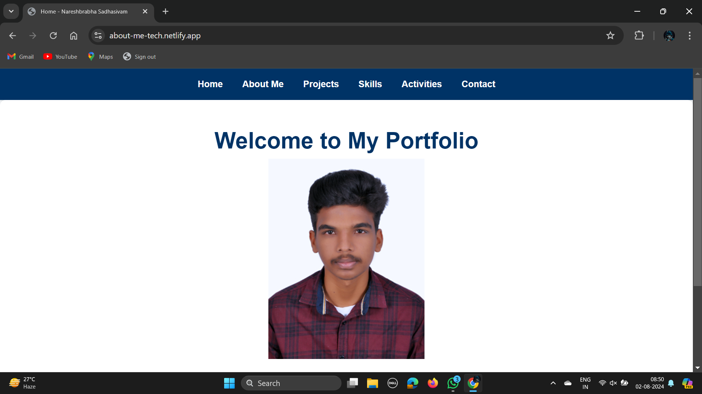
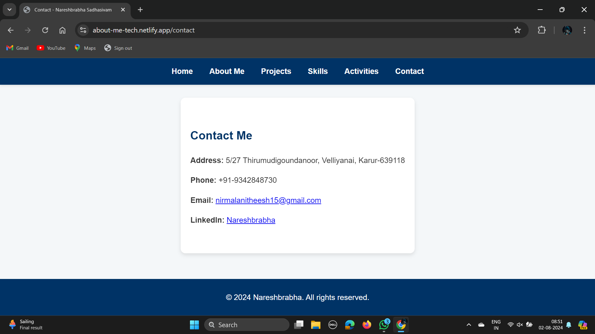

# Personal Portfolio Website

## Project Description

🚀 This project is part of my internship at Prodigy Infotech, where I built a personal portfolio website that showcases my skills, projects, and accomplishments as a web developer. The website features an attractive and visually appealing layout designed to capture visitors' attention. It includes a home page with a captivating headline, a professional photo, and a summary of my skills, as well as an "About Me" section with a detailed background, education, and professional experience.

## Features

- **Home Page**: Captivating headline, professional photo, and summary of skills.
- **About Me Section**: Detailed background, education, and professional experience.
- **Projects Section**: Showcases completed projects with descriptions and links.
- **Skills Section**: Highlights key technical and professional skills.
- **Contact Section**: Provides a way for visitors to get in touch.

## Technologies Used

- **HTML**: For structuring the website.
- **CSS**: For styling the website and creating a visually appealing layout.
- **JavaScript**: For adding interactivity and dynamic elements.

## Screenshots


*Screenshot of the home page.*


*Screenshot of the About Me section.*

## Setup Instructions

1. **Clone the repository:**
   ```bash
   git clone https://github.com/Nareshbrabha/personal-portfolio-website.git
